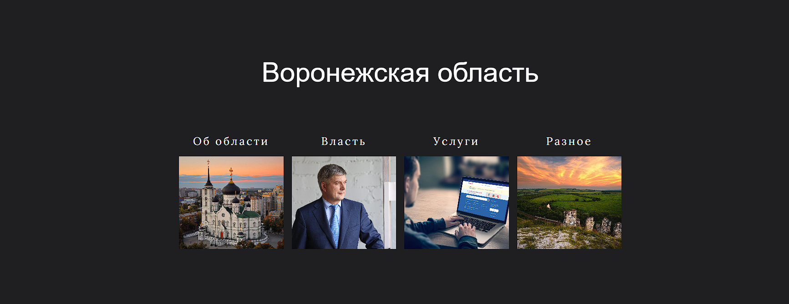
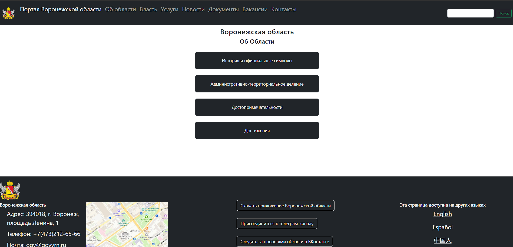

## Портал Воронежской области – “глазами молодёжи”


Данный проект представляет из себя сборку консольных мини-игр, в которых игрок должен правильно ответить на поставленные вопросы:
- Веб-сайт выполнен с использованием HTML, CSS и Bootstrap 5
- При разработке концепции сайта мы опирались на эксперимент с джемом Марка Леппера
```javascript
    На основании этого экспериментов психолог пришел к выводу, 
    что множество альтернатив, незначительно отличающихся одна от другой по своей сути, 
    ставят человека в практически безвыходное положение.
```
<h3>Главное меню<h3>


- Магия чисел
```javascript
    Цифра 4 в нумерологии означает крепкий, надёжный фундамент, создание формы, 
    основы чего угодно — планов, идей, мыслей, чувств. 
    Можно сказать, что четвёрка придаёт любым вещам форму, структурирует их, стабилизирует.
    Все вы знаете, что существует четыре стороны света, 4 времени года, четыре аспекта человеческой природы 
    (физический, ментальный, духовный, эмоциональный план), четыре стихии. 
    Геометрический символ 4 — квадрат, самая устойчивая фигура со сторонами одинаковой длины.
```
<h3>Промежуточное меню<h3>
